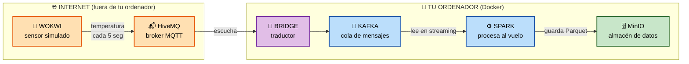
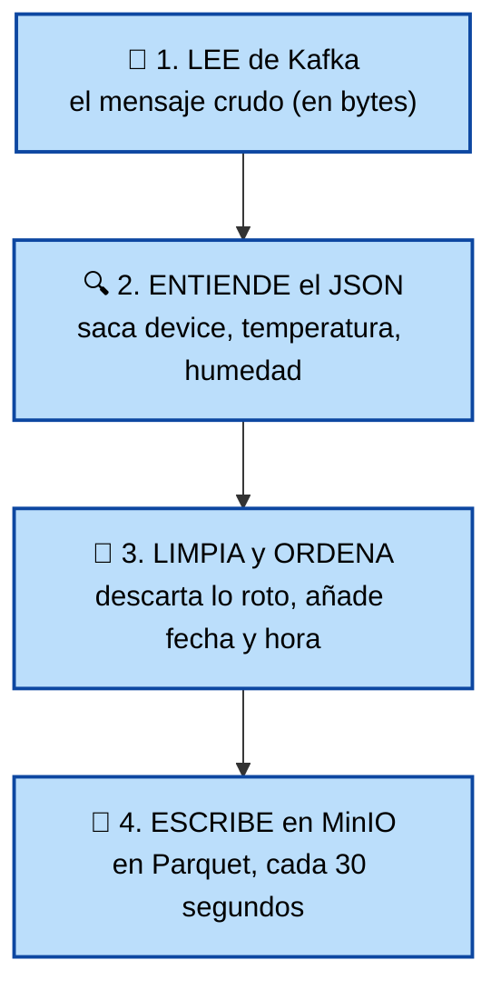
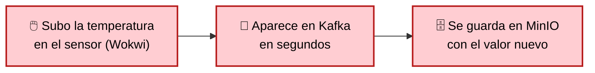
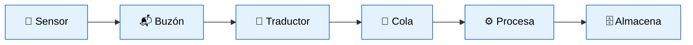

# 🌡️ Datos en Stream

## Observación de datos IoT en tiempo real

### Del sensor al almacén de datos, en directo y sin tocar nada

 

> 📸 *Sugerencia: aquí una foto chula de un sensor IoT o del circuito de Wokwi*

 

**Wokwi · MQTT · Kafka · Spark · MinIO** — todo en Docker

---

## 🎬 El flujo completo de un vistazo

> 🎤 **Para decir:** *"El dato nace en el sensor (izquierda) y viaja sin parar hasta
> el almacén (derecha). Lo que está en internet es el sensor y su buzón; lo demás
> corre en mi ordenador dentro de Docker. Ahora os enseño qué hace cada caja."*

---

## 📮 La idea, con una analogía

Imagina que mandas **una postal cada 5 segundos**:

| En la vida real… | En nuestro proyecto… |
|---|---|
| ✍️ Escribes la postal | 📡 El **sensor** mide la temperatura |
| 📬 La echas al buzón | 📬 La publica en **HiveMQ** (MQTT) |
| 🚚 El cartero la recoge | 🔌 El **bridge** la recoge |
| 🏭 Va a una cinta de clasificación | 📨 Entra en **Kafka** |
| 🔍 Un operario la revisa y ordena | ⚙️ **Spark** la procesa |
| 📦 Acaba archivada en su estantería | 🗄️ Se guarda en **MinIO** |

> 🎤 **Para decir:** *"Es como un sistema postal para datos: cada lectura es una
> carta que recorre un circuito hasta quedar archivada y ordenada."*

---

## 📡 1. Wokwi — el sensor

<table>
<tr>
<td width="55%">

**¿Qué es?**
Un sensor de temperatura y humedad **simulado** (un chip ESP32) que funciona en el navegador.

**¿Qué hace?**
Cada 5 segundos "lee" la temperatura y la envía como un mensaje JSON:
`{"device":"esp32-wokwi-01","temperature":24.5,"humidity":55}`

**¿Por qué simulado?**
Porque para aprender da igual que sea de plástico o de píxeles: el dato que viaja es idéntico. Y es **gratis e interactivo** (mueves la temperatura con el ratón).

**🔧 Un poco más a fondo**
El **ESP32** es un microcontrolador real con WiFi muy usado en IoT; el **DHT22** es un sensor típico de temperatura/humedad. Un pequeño programa en C (el *sketch*) los conecta, lee el sensor y lo **publica por MQTT**.

</td>
<td width="45%">

> 🏠 **Analogía:**
> el termómetro de la pared

> 🎤 **Si te preguntan "¿y si fuera real?":** *"El código del ESP32 sería idéntico; solo cambiaría que mide el aire de verdad. El resto del pipeline ni se entera."*

> 📸 *Captura de tu sensor en Wokwi funcionando*

</td>
</tr>
</table>

---

## 📬 2. HiveMQ — el buzón público

<table>
<tr>
<td width="55%">

**¿Qué es?**
Un **buzón en internet** (un "broker MQTT" gratuito y público).

**¿Qué hace?**
Recibe los mensajes del sensor y se los entrega a quien esté **suscrito** a ese buzón.

**¿Por qué hace falta?**
Porque Wokwi vive en internet y **no puede ver tu ordenador** directamente. Necesitan un punto de encuentro neutral que ambos alcancen.

**🔧 Un poco más a fondo**
MQTT funciona por **publicación/suscripción**: el sensor PUBLICA en un *topic* (un canal con nombre, p. ej. `iabd/usuario/iot-sensor`) y el bridge se SUSCRIBE a él. No tienen que conocerse: se comunican **a través del topic**.

</td>
<td width="45%">

> 📮 **Analogía:**
> la oficina de correos (con apartados por nombre)

> 💡 MQTT es el idioma estándar de los aparatos IoT: mensajes diminutos, ideales para dispositivos con poca batería.

> 🎤 **Si te preguntan por seguridad:** *"El broker público no tiene contraseña; por eso uso un topic de nombre único. En producción se usaría un broker propio con usuario y cifrado TLS."*

</td>
</tr>
</table>

---

## 🔌 3. Bridge — el traductor

<table>
<tr>
<td width="55%">

**¿Qué es?**
Un pequeño programa nuestro (en Python), el único código "de pegamento" del proyecto.

**¿Qué hace?**
Recoge los mensajes del buzón (HiveMQ) y los mete en Kafka, poniéndoles una etiqueta de "cuándo y por dónde entró".

**¿Por qué hace falta?**
Porque el sensor habla **MQTT** (idioma de aparatos) y Kafka habla otro idioma (el de las plataformas de datos). El bridge **traduce** entre los dos mundos.

**🔧 Un poco más a fondo**
Usa dos librerías: **paho-mqtt** (escucha HiveMQ) y **confluent-kafka** (escribe en Kafka). Por cada mensaje: lo recibe, le añade metadatos y lo publica en Kafka usando el **id del sensor como clave**. Es un productor **idempotente** (no duplica si reintenta).

</td>
<td width="45%">

> 🌉 **Analogía:**
> el cartero bilingüe que traduce

> 🎤 **Si te preguntan "¿esto no existe ya hecho?":** *"Sí — en la industria se usa 'Kafka Connect MQTT'. Lo escribí a mano para entender qué hace por dentro."*

</td>
</tr>
</table>

---

## 📨 4. Kafka — la cinta transportadora

<table>
<tr>
<td width="55%">

**¿Qué es?**
Una **cola de mensajes** industrial donde los datos avanzan en orden y nada se pierde.

**¿Qué hace?**
Recibe los mensajes en su *topic* `iot-sensor` y los guarda hasta que Spark los procesa, al ritmo que pueda.

**¿Por qué no conectar el sensor directo a Spark?**
- 🛡️ **Amortigua**: si llegan miles de golpe, aguanta.
- 🔗 **Desacopla**: si Spark se cae, no se pierde nada.
- ➕ **Multiplica**: otros pueden leer lo mismo sin tocar el sensor.

**🔧 Un poco más a fondo**
El topic tiene **3 particiones** (varias "cintas en paralelo" para repartir el trabajo). Cada consumidor lleva su **offset**: un marcapáginas de por dónde va leyendo. Funciona en modo **KRaft** (sin Zookeeper).

</td>
<td width="45%">

> 🏭 **Analogía:**
> la cinta transportadora de una fábrica

> 🎤 **Si te preguntan por las particiones:** *"Son como varias cintas en paralelo: permiten que varias máquinas procesen el mismo topic a la vez. Por eso Kafka escala."*

> 📸 *Captura de Kafka UI (localhost:8080)*

</td>
</tr>
</table>

---

## ⚙️ 5. Spark — el cerebro del pipeline ❤️

<table>
<tr>
<td width="55%">

**¿Qué es?**
El motor que **procesa los datos en streaming**. Es la pieza más potente y el **corazón** de todo el sistema.

**¿Por qué es "el corazón"?**
Porque es donde el dato **bruto se convierte en dato útil**. Las demás piezas solo transportan o guardan; **Spark es la única que TRANSFORMA**.

**¿Qué hace, en una frase?**
Está **siempre escuchando** Kafka y, según llegan los datos, los limpia, les da forma y los guarda — sin parar nunca.

</td>
<td width="45%">

> 🧠 **Analogía:**
> el operario que revisa, clasifica y archiva cada carta que llega por la cinta

> 📸 *Captura de `docker logs -f iot-spark`*

</td>
</tr>
</table>

---

## ⚙️ Spark por dentro: cómo procesa (4 pasos)

**El truco mental que hay que entender:** Spark trata el flujo como una **tabla infinita
que no para de crecer**. Escribes la consulta **una sola vez** y Spark la mantiene viva
para siempre, aplicándola a cada fila nueva que entra. Eso es *Structured Streaming*.

> 🎤 **Para decir:** *"No proceso fichero a fichero: defino una vez QUÉ hacer con cada
> lectura, y Spark lo aplica eternamente según van llegando."*

---

## ⚙️ ¿Por qué Spark y no un script normal?

| Garantía | Qué significa |
|---|---|
| 🔁 **Checkpoint** | Apunta por dónde va; si se reinicia, **retoma sin perder ni repetir** datos |
| 📦 **Micro-lotes (30s)** | Procesa en lotitos: rápido, sin generar millones de ficheros diminutos |
| 🧯 **Tolerancia a fallos** | Si se cae, Kafka guarda lo pendiente y Spark lo recupera al volver |
| 📈 **Escala sin reescribir** | El MISMO código vale para 1 sensor o para 10.000 (solo se añaden máquinas) |

> 💡 **Dato técnico potente:** mi script está en **PySpark**. Python solo *describe* el
> plan; quien **ejecuta** es el motor de Spark (en Java) dentro del contenedor. Con
> `local[*]` usa todos los núcleos de mi PC; en una empresa, el mismo script correría en
> un clúster de cien máquinas **sin cambiar una línea**.

> 🎤 **Para decir:** *"Spark es el corazón porque es donde el dato se transforma. Y no es
> un simple script: me da tolerancia a fallos, procesa en micro-lotes y escala
> horizontalmente. Por eso es el estándar de la industria."*

---

## 🗄️ 6. MinIO — el almacén final

<table>
<tr>
<td width="55%">

**¿Qué es?**
Un **almacén de datos** (data lake) igual que el de Amazon (S3), pero en tu ordenador.

**¿Qué hace?**
Guarda los datos en formato **Parquet**, ordenados en carpetas **por fecha y hora**:
`raw-data/iot-sensor/fecha=2026-06-15/hora=7/...`

**¿Por qué un almacén así?**
Los datos de sensores crecen sin parar: esto es barato, infinito y perfecto para analizar después. Y al ser como S3, vale igual para la nube real.

**🔧 Un poco más a fondo**
Habla la **API S3** de Amazon (mismo protocolo), por eso Spark le escribe con `s3a://`. **Parquet** guarda por **columnas** y comprimido: ocupa menos y las consultas leen solo lo que necesitan. El **particionado** por fecha/hora hace que "dame ayer de 7 a 8" lea solo esa carpeta.

</td>
<td width="45%">

> 📦 **Analogía:**
> el almacén con estanterías ordenadas por fecha

> 🎤 **Si te preguntan "¿por qué Parquet y no CSV?":** *"Parquet es columnar y comprimido: ocupa mucho menos y es muchísimo más rápido de analizar. Es el estándar del big data."*

> 📸 *Captura de MinIO (localhost:9001)*

</td>
</tr>
</table>

---

## 🎬 La demo en vivo (el momento estrella)

**Lo que enseño, en 4 ventanas a la vez:**

1. 🖥️ **Wokwi** (navegador) → el sensor publicando, en el monitor serie
2. 🔌 **Bridge** → `docker logs -f iot-bridge`, los mensajes entrando a Kafka
3. 📊 **Kafka UI** (localhost:8080) → los JSON dentro de la cola
4. 🗄️ **MinIO** (localhost:9001) → los Parquet apareciendo en `raw-data`

> 🎤 **Para decir:** *"Muevo el deslizador de temperatura del sensor a 35 °C y lo veis
> llegar al final del circuito en segundos. Eso es streaming de verdad: el dato no espera."*

📸 *Aquí puedes poner 3 capturas en fila: Wokwi → consola del bridge → MinIO*

---

## 🛡️ ¿Y si algo falla? (resiliencia)

| Si se cae… | Qué pasa |
|---|---|
| 📡 El sensor (Wokwi) | El resto **espera tranquilo**; al volver, sigue |
| ⚙️ Spark | Kafka **guarda los mensajes**; al volver, retoma sin perder nada |
| 🔌 El bridge | Docker **lo reinicia solo** |
| 🌊 Llegan muchísimos datos | Kafka **amortigua** y reparte la carga |

> 🎤 *"Ninguna caída individual rompe el sistema ni pierde datos. Y para crecer a miles
> de sensores, la arquitectura no cambia: solo se añaden más máquinas."*

---

## 🛠️ Tecnologías usadas (y por qué)

| Pieza | Tecnología | Por qué esta |
|---|---|---|
| 📡 Sensor | Wokwi (ESP32 + DHT22) | IoT sin hardware, gratis e interactivo |
| 📬 Mensajería IoT | MQTT / HiveMQ | Estándar IoT; broker público, nada que instalar |
| 📨 Cola | Apache Kafka 4.1 (KRaft) | Estándar de colas de datos; sin Zookeeper |
| ⚙️ Procesado | Apache Spark 4.1 (PySpark) | Estándar big data en streaming |
| 🗄️ Almacén | MinIO (S3) | Data lake, igual que la nube real |
| 🐳 Orquestación | Docker Compose | Todo con un comando, reproducible |

> 🎤 **Para decir:** *"Todas son herramientas reales de empresa. No he inventado nada:
> he montado la arquitectura estándar de ingesta IoT con un sensor de aprendizaje."*

---

## ✅ Resumen

- ✅ Datos IoT viajando **en tiempo real** de extremo a extremo
- ✅ Piezas **estándar de la industria**, cada una con un papel claro
- ✅ **Tolerante a fallos**, escalable y reproducible **con un comando**

### **¿Preguntas?** 🙋

---

<!--
============================================
CÓMO USAR ESTA PRESENTACIÓN
============================================
• Para verla bonita: en VS Code pulsa Ctrl+Shift+V (vista previa). Los diagramas
  Mermaid y las tablas se dibujan solos. En GitHub también se ve renderizada.
• Para añadir tus capturas: haz una carpeta "docs/img", mete ahí los PNG, y sustituye
  las líneas "📸 ..." por:   
• Para exportar a PDF: instala la extensión "Markdown PDF" (o "Marp for VS Code") y
  exporta. Mermaid se renderiza en el PDF.
-->
